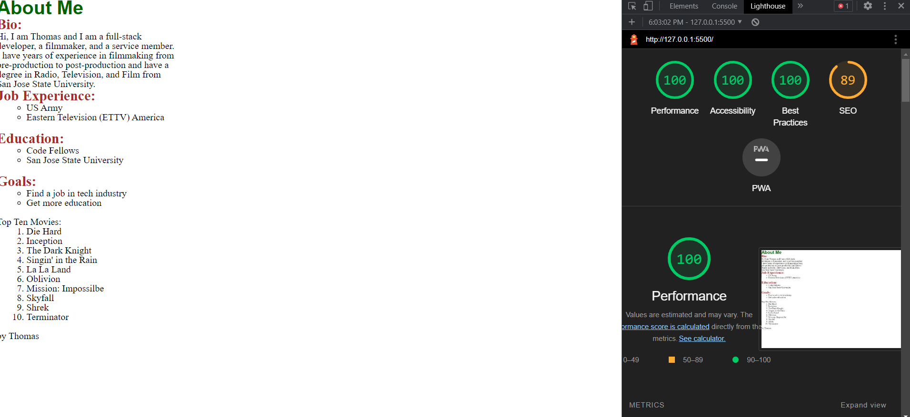
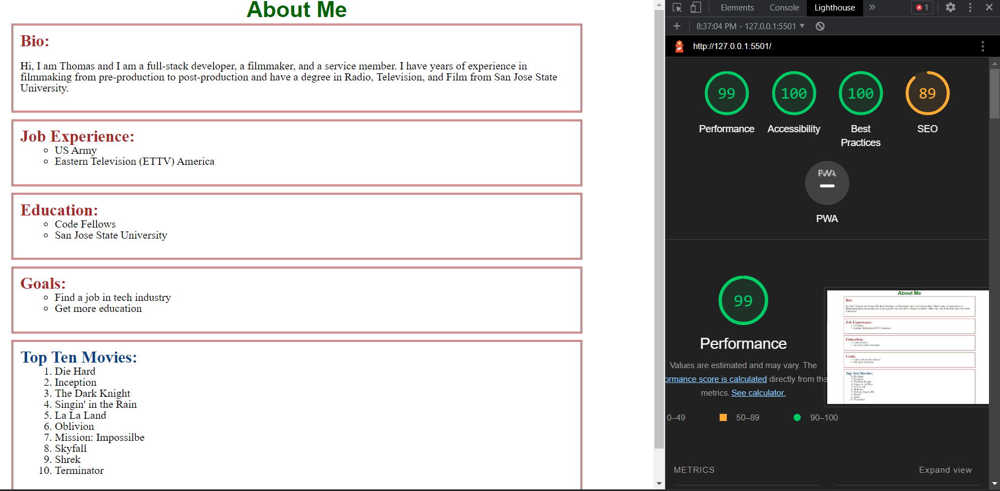

# LAB - 02

## About me

This is a page about myself.

### Author: Thomas Lau

### Links and Resources

* [span vs div from GeeksForGeeks](https://www.geeksforgeeks.org/difference-between-div-and-span-tag-in-html/)


### Lighthouse Accessibility Report Score

lab2


lab3


lab5


### Reflections and Comments

1/24: 
- It took longer than I think (about 3 hours, but I thought it would bbe 2 hours of work), I was surprised on how much more work I have to do to style the content after reset.css applied to the page first. I feel like resetting the CSS is useful, but it takes some time to recreate the preset style.
- I found out that `<span>` is for inline elements and `<div>` is for block-level content. I tried to use `<span>` on a block of content and it didn't work.
- `<script src="js/app.js"></script>` in the `<body>` will trigger the function without calling it.
- You can put multiple css files in the `<head>` and one use is to reset the stylesheet.
- `.toUpperCase()` can be put behind a `prompt()` instead of each condition. eg. `let math = prompt("Yes or no question: 1+1=2").toUpperCase();`
- `math === "YES" || math === "Y"` is the shortest form, you cannot write `math === "YES" || "Y" `
- in the terminal, use `-a` to list hidden files
- in the terminal, you can create multiple files/directories with **space**
` touch file1.a file2.a path/file3.a`

1/25:
- Took me over 5 hours to do it. I spent hours trying to figure out how to do the lab especially the part where it asks you to use loop with limited attempts. I was able to achieve what I want for Q6, but it was not te best way. TA Michael was able to teach me a better way to achieve the same goal. He taught me to start small and at the end at the attempts limiter at the end. Overall, I found it very challenging along withe my classmates with the knowledge we have right now. Maybe lab demo could demostrate a bit more on how to approach this problem. 

- Learned array method 
  - `.push()` to add an item to the end of an array (eg. array.push('extra item1',  'extra item 2'); )

  - `.unshift()` to add an item to the front of an array

- put this on top of CSS, so width will work as intent

```
*{
box-sizing: border-box;
}
```

- `<div>` is a block element, will take up whole line

- `<span>` is an inline element, will take up as much space as needed, dont have marginon top and bottom

- you can do either  display: inline-block; or float: left;

- to center element on screen (not text); use

```
margin-left: auto;

margin-right: auto;

with both set to auto, it will split margin into half
````

1/26: 
Driver: Mohammed Abubakar
Navigator: Thomas Lau

learned:

```
on github top right create a FORK,
then copy the html from CODE
use `git clone LINK` to download
after changes and ACP 
send a git pull request , wait for it to be approved and merged <= owner will now see the changes

(if someone send you a pull request, u can approved the merge and then update your local commit to latest by doing the following)
then you can update your local files with terminal command: git pull (while you are in your folder)
```


-the following can turn string number into number:

parseInt(variable / 'number' / prompt())
+prompt()

- default value (needs to be at the end) in function:

```
function xx (value1, value2 ="default value"){

console.log(`Hi ${value1} and ${value2});

}

xx(abc);

will shows 'Hi abc default value'
```