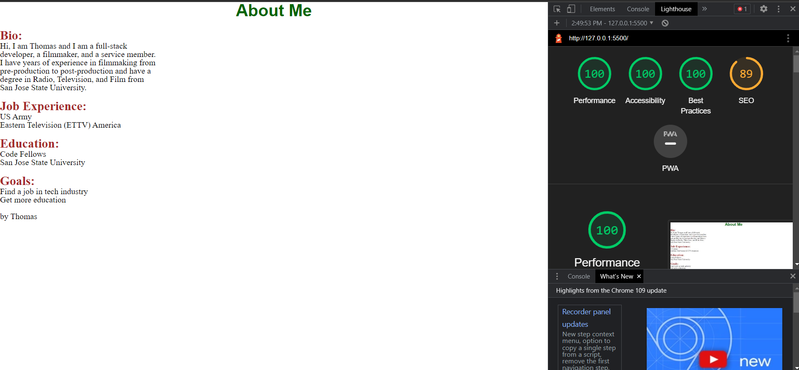

# LAB - 02

## About me

This is a page about myself.

### Author: Thomas Lau

### Links and Resources

* [span vs div from GeeksForGeeks](https://www.geeksforgeeks.org/difference-between-div-and-span-tag-in-html/)

### Lighthouse Accessibility Report Score

### Reflections and Comments

1/24: 
- It took longer than I think (about 3 hours, but I thought it would bbe 2 hours of work), I was surprised on how much more work I have to do to style the content after reset.css applied to the page first. I feel like resetting the CSS is useful, but it takes some time to recreate the preset style.
- I found out that `` is for inline elements and `
` is for block-level content. I tried to use `` on a block of content and it didn't work.
- `` in the `<body>` will trigger the function without calling it.
- You can put multiple css files in the `<head>` and one use is to reset the stylesheet.
- `.toUpperCase()` can be put behind a `prompt()` instead of each condition. eg. `let math = prompt("Yes or no question: 1+1=2").toUpperCase();`
- `math === "YES" || math === "Y"` is the shortest form, you cannot write `math === "YES" || "Y" `
- in the terminal, use `-a` to list hidden files
- in the terminal, you can create multiple files/directories with **space**
` touch file1.a file2.a path/file3.a`